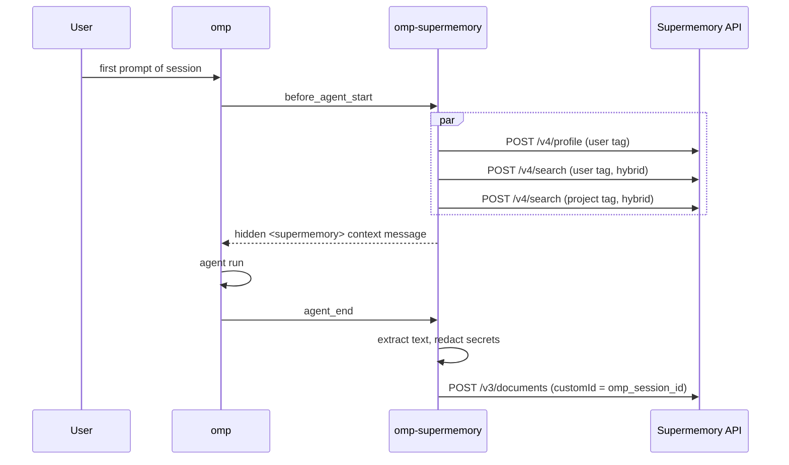

# omp-supermemory

Persistent long-term memory for the [oh-my-pi](https://github.com/can1357/oh-my-pi) (`omp`) coding agent, backed by [Supermemory](https://supermemory.ai). The extension hooks the agent lifecycle to recall relevant context at the start of a session, capture conversation transcripts as the session progresses, and expose explicit search, add, and forget tools to the model. It targets either the hosted Supermemory API or a self-hosted `supermemory-server`, selected by a single base-URL setting.

omp's built-in `memory.backend` setting is a closed enumeration (`off`, `local`, `hindsight`, `mnemopi`, `sharpshooter`) with no plugin point, so this is implemented as an extension rather than a backend. A native `memory.backend: supermemory` implementation is available on a fork; see [Native backend](#native-backend).

## Features

- Session-start recall of the user profile and of relevant user-scoped and project-scoped memories, injected as a hidden context message.
- Automatic capture of user and assistant text at `agent_end`, upserted per session so a session maps to exactly one document.
- Hybrid search (`searchMode: "hybrid"`), so raw document chunks are retrievable even when LLM memory extraction has not run or has failed.
- Two memory scopes: `user` (cross-project) and `project` (per git root).
- Explicit tools (`supermemory_search`, `supermemory_add`, `supermemory_forget`) and a `/supermemory` slash command.
- Secret redaction of captured transcripts and explicit adds before upload.
- Graceful degradation: without an API key the extension loads, emits a single warning, and performs no network calls.

## Deployment options

The extension speaks the Supermemory HTTP API (`/v4/search`, `/v4/profile`, `/v3/documents`, `/v4/memories`). Both deployment targets are supported equally; the only differences are the base URL, the credential source, and the recommended similarity threshold.

### Supermemory Cloud (hosted, managed)

1. Create an account and generate an API key in the [Supermemory console](https://console.supermemory.ai).
2. Export the key. The default endpoint is `https://api.supermemory.ai`, so no URL override is needed.

```sh
export SUPERMEMORY_API_KEY=sm_...
```

No infrastructure is required. Conversation transcripts and explicitly added memories are processed and stored by a third party; evaluate this against your data residency, retention, and confidentiality requirements before enabling capture on proprietary code. Capture can be disabled with `SUPERMEMORY_CAPTURE_EVERY=0` while keeping recall and the explicit tools.

### Self-hosted

Run [supermemory-docker](https://github.com/Ansh-Sonkusare/supermemory-docker), which packages `supermemory-server`. Memory extraction needs an LLM: OpenAI, Anthropic, Gemini, Groq, or a local OpenAI-compatible endpoint such as Ollama or llama.cpp `llama-server`.

```sh
git clone https://github.com/Ansh-Sonkusare/supermemory-docker && cd supermemory-docker
echo 'OPENAI_API_KEY=sk-...' > .env   # any one supported provider
docker compose up -d --build

export SUPERMEMORY_API_URL=http://127.0.0.1:6767
export SUPERMEMORY_API_KEY=$(docker compose exec -T supermemory cat /data/api-key)
export SUPERMEMORY_THRESHOLD=0.3
```

For a fully local stack, point the server at an OpenAI-compatible endpoint. Tested with `qwen2.5:7b` on Ollama:

```sh
# supermemory-docker/.env
OPENAI_API_KEY=dummy
OPENAI_BASE_URL=http://host.docker.internal:11434/v1   # llama-server: http://host.docker.internal:8080/v1
OPENAI_MODEL=qwen2.5:7b
```

Behavior observed against `supermemory-server` v0.0.8:

- The first request after boot triggers an embedding model download (about one minute). Recall requests time out until it completes.
- Document ingest is asynchronous. `forget` against a document still in flight returns `409 Document is still processing`; the client retries with backoff (see [Forget semantics](#forget-semantics)).
- Local embeddings produce lower similarity scores than the hosted API. A threshold of `0.3` gives better recall than the default `0.6`.

### Comparison

| | Hosted | Self-hosted |
|---|---|---|
| Operational burden | None | Docker host, upgrades, backups, LLM endpoint |
| Data locality | Third-party processor | Stays on your infrastructure (except calls to a hosted LLM, if you choose one) |
| LLM extraction quality | Managed by Supermemory | Depends on the configured model; small local models extract less reliably |
| Embedding model | Hosted embeddings | Local embedding model, downloaded on first use |
| `SUPERMEMORY_API_URL` | `https://api.supermemory.ai` (default) | `http://127.0.0.1:6767` |
| API key source | Supermemory console | `/data/api-key` in the container |
| Recommended `SUPERMEMORY_THRESHOLD` | `0.6` (default) | `0.3` |

## Installation

```sh
git clone https://github.com/Ansh-Sonkusare/omp-supermemory ~/omp-supermemory
cd ~/omp-supermemory && bun install
```

Load the extension with any one of:

1. **Config file.** In `~/.omp/agent/config.yml`:
   ```yaml
   extensions:
     - ~/omp-supermemory
   ```
2. **Symlink.** `ln -s ~/omp-supermemory ~/.omp/agent/extensions/omp-supermemory`
3. **One-off.** `omp -e ~/omp-supermemory`

Then configure a deployment target as described above and restart `omp`. Run `/supermemory status` to confirm the key, base URL, and container tags.

## Configuration

Environment variables take precedence over the config file. Numeric values that fail to parse fall back to their defaults.

| Setting | Default | Description |
|---|---|---|
| `SUPERMEMORY_API_KEY` | none | API key. Falls back to `apiKey` in the config file. |
| `SUPERMEMORY_API_URL` | `https://api.supermemory.ai` | API base URL. Trailing slashes are stripped. |
| `SUPERMEMORY_RECALL_LIMIT` | `5` | Maximum hits per search, per scope. |
| `SUPERMEMORY_THRESHOLD` | `0.6` | Minimum similarity score for returned hits. |
| `SUPERMEMORY_CAPTURE_EVERY` | `1` | Capture on every Nth agent run per session. `0` (or negative) disables capture. |
| `SUPERMEMORY_AUTO_RECALL` | `true` | Any value other than `false` leaves session-start recall enabled. |
| `~/.config/omp-supermemory/config.json` | none | `{"apiKey": "..."}`. Only `apiKey` is read from this file. |

Requests use a 15 second timeout.

## Architecture



### Lifecycle

- **Recall (`before_agent_start`).** On the first prompt of each session, main agent only (subagents are skipped), the extension issues three concurrent requests: the user profile and one hybrid search against each of the user and project tags, all keyed on the prompt. Each request is settled independently, so a failure in one does not suppress the others. Results are deduplicated by hit id and injected as a non-displayed message of type `omp-supermemory.recall`, wrapped in `<supermemory>` tags and framed as background context rather than instructions. Recall runs at most once per session.
- **Capture (`agent_end`).** When the agent run is not about to continue (`willContinue` is false), every Nth run (`SUPERMEMORY_CAPTURE_EVERY`) the extension builds a transcript from `user` and `assistant` text blocks only. Tool calls, tool results, and thinking blocks are dropped, previously injected `<supermemory>` blocks are stripped to prevent recall feedback into storage, and the transcript is truncated to its trailing 100,000 characters. It is posted to `/v3/documents` under the project tag with `customId = omp_session_<sessionId>`, so each subsequent capture updates the same document. Capture is fire-and-forget and does not block the agent loop; the first failure per process is surfaced as a single warning.

### Container tags

Memory is partitioned by two Supermemory `containerTag` values:

- User: `omp_user_<sha256(USER)[:16]>`. Holds cross-project memory. `USER` is taken from the environment, falling back to the OS account name.
- Project: `omp_project_<name>_<sha256(root)[:16]>`. `root` is the nearest ancestor of the working directory containing `.git`, or the working directory itself if none exists. `name` is the lowercased basename of `root` with characters outside `[a-z0-9_]` replaced by `_`. Hashing the absolute path keeps same-named repositories at different locations distinct.

### Hybrid search

All searches use `searchMode: "hybrid"`, which returns both extracted memories and raw document chunks. This matters because memory extraction is asynchronous and LLM-dependent: on a self-hosted instance with a small local model, or immediately after ingest, no extracted memories may exist yet, and a memory-only search would return nothing. Chunk hits carry a document-chunk id rather than a memory id, which determines the forget behavior below.

### Secret redaction

Outbound content is passed through a redaction step before upload: the `agent_end` transcript, `supermemory_add` content, and `/supermemory add` text. Matches are replaced with `[REDACTED]`. Covered patterns:

- GitHub tokens (`ghp_`, `gho_`, and sibling prefixes)
- OpenAI-style `sk-` keys
- AWS access key ids
- Slack tokens
- Google API keys
- JWTs
- keyword-prefixed secrets (`password=`, `token=`, `secret=`, and similar)
- PEM private key blocks
- `Bearer` tokens

Redaction is pattern-based and therefore best-effort; it does not guarantee that arbitrary sensitive content (low-entropy passwords, proprietary source, personal data) is removed.

### Forget semantics

`supermemory_forget` first issues `DELETE /v4/memories` with `{id, containerTag}`. If the server responds `404`, which occurs when the id is a document-chunk id from a hybrid search hit rather than a memory id, the client falls back to `DELETE /v3/documents/{id}`. Search results report the owning document id when available, and that id is what the tools display. Ingest is asynchronous, so a recently captured document cannot be deleted until it finalizes and the server responds `409`. Both the memory delete and the document-delete fallback retry on `409` for up to 5 attempts in total, with exponential backoff of 1 s, 2 s, 4 s, and 8 s between attempts (about 15 s worst case). The wait is abortable via the tool's signal. If all attempts return `409`, the error is surfaced to the model.

## Tools and slash command

| Name | Parameters | Behavior |
|---|---|---|
| `supermemory_search` | `query`, `scope?: user \| project \| both` (default `both`), `limit?` (default `SUPERMEMORY_RECALL_LIMIT`) | Hybrid search in the selected scope(s). Returns `[scope] id: text (similarity n.nn)` lines. |
| `supermemory_add` | `content`, `scope?: user \| project` (default `project`) | Stores a memory and returns its id. |
| `supermemory_forget` | `id`, `scope: user \| project` | Deletes a memory by id from `supermemory_search` output. See [Forget semantics](#forget-semantics). |
| `/supermemory status` | none | Shows key presence, base URL, user tag, and project tag. |
| `/supermemory search <query>` | query | Searches both scopes. |
| `/supermemory add <text>` | text | Stores text in project scope. |

Without an API key, the tools return a setup message and `/supermemory status` reports the key as missing.

## Native backend

The fork [Ansh-Sonkusare/oh-my-pi](https://github.com/Ansh-Sonkusare/oh-my-pi), branch `feat/supermemory-memory-backend`, implements Supermemory as a first-class memory backend selectable with `memory.backend: supermemory`. It reads the same `SUPERMEMORY_API_KEY` and `SUPERMEMORY_API_URL` variables and supports the `recall`, `retain`, and `learn` memory tools. Use the fork if you want Supermemory integrated into omp's native memory pipeline; use this extension to stay on upstream omp.

## Security and privacy

- Transcripts and added memories are sent to the configured Supermemory endpoint. With the hosted API this is a third-party processor; with a self-hosted server it is your own infrastructure, plus any hosted LLM provider you configure for extraction.
- Secrets are redacted before upload (transcripts and explicit adds) on a best-effort, pattern-matched basis. Treat redaction as defense in depth, not as a guarantee.
- The API key is read from the environment or `~/.config/omp-supermemory/config.json`; restrict the file permissions (`chmod 600`) if you use it.
- Recalled content is injected as context framed as non-instructional. Treat memory stores as untrusted input, since stored text originates from prior conversations and may contain prompt-injection payloads.
- `SUPERMEMORY_CAPTURE_EVERY=0` disables upload of transcripts; `SUPERMEMORY_AUTO_RECALL=false` disables automatic recall.

## Development

```sh
bun install
bun test
bun run typecheck
```

Tests use `bun:test` with an injected `fetch`. `scripts/mock-server.ts` provides a local mock of the Supermemory API for smoke-testing the extension in a real `omp` session without a live account or a running `supermemory-server`.

## Project docs

- [docs/PRD.md](docs/PRD.md): product requirements.
- [docs/STACK.md](docs/STACK.md): technology choices.
- [docs/TODO.md](docs/TODO.md): status and roadmap.

## License

MIT
