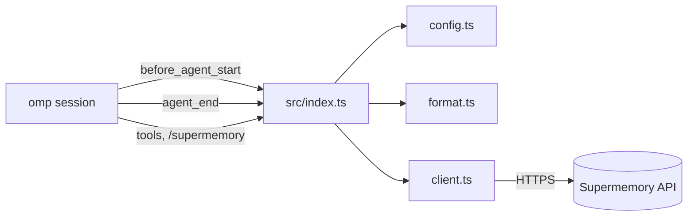

# Stack

- Runtime: Bun, TypeScript run directly, no build step.
- Host: omp 18.x extension API (`@oh-my-pi/pi-coding-agent`, types only).
- Network: global `fetch`. No runtime dependencies.
- Tests: `bun test` with injected fetch mocks.

## Architecture

## File map

| File | Role |
|---|---|
| `src/config.ts` | `loadConfig`, `userTag`, `projectTag` |
| `src/client.ts` | `SupermemoryClient`, `SupermemoryError` |
| `src/format.ts` | `formatRecall`, `transcriptFromMessages` |
| `src/index.ts` | Extension factory: hooks, tools, command |
| `test/*.test.ts` | Behavior tests, no network |

## Design decisions

- **fetch, not the SDK.** Four endpoints; avoids a dependency and install step.
- **`customId` upsert per session.** Each capture resends the full (tail-capped) transcript under `omp_session_<id>`, so Supermemory holds one document per session and re-adds update it.
- **First-prompt-only recall.** One recall per session bounds latency and token cost, and keeps the prompt prefix cache stable. Later context is available through the search tool.
- **Hidden message, not system prompt edit.** `display: false` custom message framed as background context, so memory text is not treated as instructions.
- **Failures are tolerated.** Recall uses `Promise.allSettled`; capture errors notify only once.
